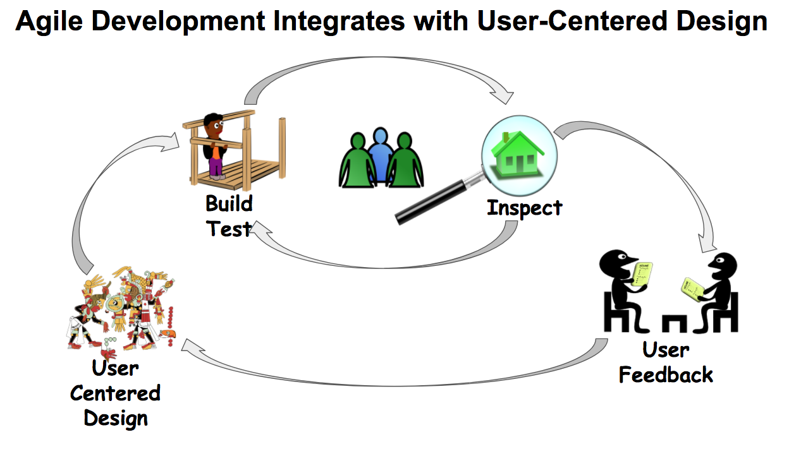

The Agile Manifesto is realized at 18F in the combined practices of iterative software development, product management, user-centered design, and DevOps.

We start with a product vision and strategy, informed by users and the overall mission or 18F or one of our partner agencies. We do this so that the work always stays connected to an overarching goal that everyone understands and is excited about.

We also work to ensure that the infrastructure and process is there to enable continuous delivery of software to real users (DevOps), and that a clear agile delivery process is set up. Teams are free to tailor their agile process to suit their own situations. Many of them employ the SAFe methodology, while other teams use more traditional Scrum or Kanban methods.

We conduct discovery research before we build anything. Depending on the complexity of your problem space, this can take up to 2 to 3 months. As opposed to ‘requirements gathering’, this process involves actually visiting with users and prototyping to test out multiple concepts quickly before investing a lot of money in building something.

When we build, we aim to release early and often to real users in real life situations. Having well-researched hypotheses beforehand allows us to be deliberate about what we build and why. Research continues throughout the agile process that we can test our hypotheses and pivot when needed.

Since our work is centered around user research and user feedback, it’s important to develop participant recruiting strategies, and a research and feedback cadence that will work within the constraints of your agile process, and to ensure that the team is staffed appropriately.

